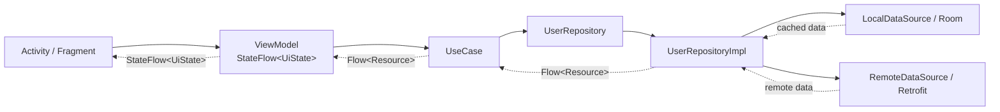

# 我是如何把一个传统 Android 协程示例，重构成 Clean Architecture + Koin DI 项目的

`Learn-Kotlin-Coroutines` 原本是 Amit Shekhar 的一个 Android 协程教学项目。Amit Shekhar 本身是一位优秀的 Android 实战性讲师，这个项目在大约四年前的语境下，其实是一个质量不错、很适合入门的示例工程。

原项目 GitHub 地址：

- 仓库地址：[amitshekhariitbhu/Learn-Kotlin-Coroutines](https://github.com/amitshekhariitbhu/Learn-Kotlin-Coroutines)
- 作者主页：[Amit Shekhar](https://github.com/amitshekhariitbhu)

如果只看它原本的教学目标，这个项目的优点很明显。

从结构上看，它更像一个“按场景拆分的协程示例集合”，而不是一个强调工程边界的业务项目。主线大致是：

- `ui/basic`：基础协程示例
- `ui/retrofit/*`：单次、串行、并行网络请求
- `ui/room`：本地数据库
- `ui/errorhandling/*`：异常处理相关示例
- `ui/task/*`、`ui/timeout`：长任务、超时等协程场景

这种组织方式的优点很直接：

- 协程场景覆盖比较全
- 网络请求、数据库、异常处理、超时控制这些主题都有示例
- 对初学者来说，页面入口直接，学习路径也清楚
- 每个示例基本可以单独理解，阅读门槛低

如果只站在“协程入门示例”的角度看，这个项目到今天依然有参考价值。

更客观一点说，Amit Shekhar 这类项目更偏“知识点驱动”，而不是“结构驱动”。  
这也是为什么它非常适合入门，但并不适合作为一个可直接延展的工程模板。

但问题也恰恰来自这种“示例集合式结构”。一个适合教学的示例项目，不一定适合继续往真实业务工程演进。把它放到今天的 Android 工程视角下再看，原始结构仍然暴露出不少典型问题。

从架构上看，原始版本更接近一种传统的、偏扁平化的 MVVM 示例结构：

- `Activity` 直接和 `ViewModel` 配合
- `ViewModel` 直接依赖 `ApiHelper`、`DatabaseHelper`
- 数据获取、异常处理、状态更新集中在表现层
- 依赖创建通过页面或 `ViewModelFactory` 手动管理

这种结构在教学场景下有它的合理性，因为链路短、容易讲清楚。但它的缺点也很明显：

- `Activity` 或 `ViewModelFactory` 负责组装依赖
- `ViewModel` 直接调用网络层和数据库层
- 状态更新和异常处理都堆在表现层
- 新增一个页面，就要继续复制一套依赖创建逻辑
- 数据获取更偏“一次性主动拉取”，不够贴近现在常见的 Flow 响应式写法

这类项目很适合入门，但如果继续往真实业务开发靠，就会很快暴露出结构问题。

所以我这次做的事情，不是否定这个项目原本的教学价值，而是在保留它示例价值的前提下，对它做一次现代化、工程化的重构。

换句话说，这次优化的出发点是：

- 承认它在当时是一个不错的教学项目
- 也承认它放到今天仍然存在明显的架构短板
- 然后在这个基础上，补上它原来缺失的工程能力

具体来说，我做了这些改造：

- 从没有依赖注入，改成 `Koin DI`
- 从 `ViewModel` 直连数据源，改成 `UseCase + Repository`
- 从职责混杂的表现层，改成 `UI -> Domain -> Data` 分层
- 从分散处理异常，改成 `Repository` 统一返回 `Resource`
- 从主动获取和手动推送 UI 状态，改成 `Flow -> StateFlow` 的响应式数据流

这篇 README 也不再只是项目说明，而是按一次真实重构过程来写清楚：

- 这个项目原本为什么值得学
- 原来的问题是什么
- 为什么这些问题值得改
- 我是怎么一步步改成现在这样的
- 改完之后，代码结构到底发生了什么变化

如果你也正在维护一个“能跑，但不太好继续扩展”的 Android 示例项目，这篇文章的重点不是告诉你某个框架有多高级，而是给出一条足够务实的重构路径。

这次重构的核心目标不是“更规范”，而是降低未来新增功能时的结构成本。

---

## 一、先把方法论说清楚：这次重构遵守了哪些结构原则

在进入具体代码之前，可以先把这次重构最终落下来的结构原则提炼出来。

这很重要，因为这篇文章不只是想说明“我改了哪些文件”，而是想说明：

> 如果以后再遇到类似的 Android 示例项目，应该按什么原则去重构。

### 1. 依赖方向必须固定

这次重构里，依赖方向被严格收敛成：

`UI -> Domain -> Data`

也就是说：

- `UI` 依赖 `Domain`
- `Domain` 依赖抽象，不依赖具体数据实现
- `Data` 负责实现这些抽象

一旦这个方向固定下来，层与层之间的职责就不会继续相互渗透。

### 2. UI 层只做三件事

UI 层在这次重构后，只保留三类职责：

- 订阅状态
- 触发行为
- 渲染界面

它不再负责：

- 创建依赖
- 编排业务
- 决定数据来自哪里
- 处理底层异常策略

### 3. Domain 层是稳定边界

`Domain` 层在这里承担的是“结构稳定器”的角色：

- `UseCase` 负责表达业务动作
- `Repository` 接口负责隔离数据实现
- `Resource` 负责统一业务结果模型

换句话说，UI 怎么变、数据源怎么变，都不应该直接冲击到 Domain 的边界表达。

### 4. Data 层不是搬运层，而是策略层

这次重构之后，`Data` 层不只是“调接口 + 查数据库”，它还负责：

- 缓存优先级
- 刷新策略
- 错误传播策略
- 连续数据流建模

所以这里的 `RepositoryImpl` 不是简单 DAO/Api 包装器，而是数据策略协调器。

### 5. 状态应该被订阅，而不是被手动推送

最后一个核心原则是：

> UI 不再主动驱动数据，而是订阅已经存在的状态流。

这也是为什么这次重构最终会落到 `Flow -> StateFlow -> repeatOnLifecycle + collect` 这一整条链路上。

如果把这些原则压缩成一句话，就是：

> 这次重构不是在堆技术点，而是在重新定义职责边界、依赖方向和状态流动方式。

---

## 二、原项目为什么能学，但不能直接拿来长大

先说明一点：原项目并不是“写得差”，而是它的定位本来就更偏教学示例，而不是工程化模板。

这也是为什么它在四年前看起来完全合理：

- 页面直接展示协程场景，学习成本低
- ViewModel 直接处理逻辑，代码路径短
- 示例之间相互独立，方便单点理解

但一旦目标从“演示协程用法”变成“作为一个可继续演进的 Android 项目基础”，问题就会开始放大。

传统协程示例项目最大的问题，不是“代码错了”，而是“结构开始失控了”。

最典型的情况，就是没有依赖注入时，依赖关系往往只能靠手动管理。

项目里保留的旧版 `ViewModelFactory` 很能说明问题：

```kotlin
class ViewModelFactory(
    private val apiHelper: ApiHelper,
    private val dbHelper: DatabaseHelper
) : ViewModelProvider.NewInstanceFactory() {

    override fun <T : ViewModel> create(modelClass: Class<T>): T {
        if (modelClass.isAssignableFrom(SingleNetworkCallViewModel::class.java)) {
            return SingleNetworkCallViewModel(apiHelper, dbHelper) as T
        }
        if (modelClass.isAssignableFrom(SeriesNetworkCallsViewModel::class.java)) {
            return SeriesNetworkCallsViewModel(apiHelper, dbHelper) as T
        }
        // 每新增一个 ViewModel，都要继续追加判断
        throw IllegalArgumentException("Unknown class name")
    }
}
```

刚开始页面少的时候，这种写法似乎问题不大。但只要项目继续扩展，问题会立刻出现：

- 每新增一个 `ViewModel`，都要改 Factory
- Factory 会变成一个越来越大的分发中心
- 页面层知道太多对象创建细节
- 测试时很难优雅地替换真实依赖

本质上，这不是“写法繁琐”那么简单，而是依赖关系没有被正确建模。

一句话总结这一阶段的问题：

> 代码的问题不在于它不能运行，而在于它无法以低成本继续演进。

换句话说，这次重构真正要解决的，不是“示例代码不够优雅”，而是它还不具备抵抗复杂度增长的能力。

---

## 三、第一刀先下在依赖管理：把依赖图从 UI 层收回来

如果依赖关系本身就是分散、手动、硬编码的，那后面的架构优化很容易流于表面。

所以这次重构，我先处理的是依赖管理问题。

### 1. 重构前：对象靠页面或 Factory 手动拼装

没有 DI 时，页面层通常需要间接承担依赖创建责任。即便不是直接 `new`，也会通过 `ViewModelFactory` 把依赖一路传进去。

这种模式最大的问题有两个：

- 对象创建逻辑和业务展示逻辑混在一起
- 依赖关系散落，扩展和测试成本都高

但如果从架构层面看，更本质的问题其实是：

> 没有 DI 的本质问题不是“代码多”，而是依赖关系被泄露到了 UI 层。

一旦 UI 知道依赖如何构造，它就同时承担了两种职责：

- 展示
- 组装系统

这才是结构会逐渐失控的根源。

### 2. 重构后：把依赖集中交给 Koin

现在项目里，依赖关系被集中声明在模块中：

```kotlin
val appModule = module {
    single { RetrofitBuilder.apiService }
    single<ApiHelper> { ApiHelperImpl(get()) }
    single { DatabaseBuilder.getInstance(androidContext()) }
    single<DatabaseHelper> { DatabaseHelperImpl(get()) }
    single<UserRepository> { UserRepositoryImpl(get(), get()) }

    factory { GetUsersUseCase(get()) }
    factory { GetMoreUsersUseCase(get()) }
    factory { GetUsersFromDbUseCase(get()) }
    factory { GetUsersWithErrorUseCase(get()) }
    factory { GetUsersSeriesUseCase(get()) }
    factory { GetUsersParallelUseCase(get()) }
}

val viewModelModule = module {
    viewModel { SingleNetworkCallViewModel(get()) }
    viewModel { SeriesNetworkCallsViewModel(get()) }
    viewModel { ParallelNetworkCallsViewModel(get()) }
    viewModel { RoomDBViewModel(get()) }
}
```

然后在应用启动时统一初始化：

```kotlin
class CoroutinesApp : Application() {

    override fun onCreate() {
        super.onCreate()
        startKoin {
            androidContext(this@CoroutinesApp)
            modules(listOf(appModule, viewModelModule))
        }
    }
}
```

页面层也终于可以回到它该有的样子：

```kotlin
class SingleNetworkCallActivity : AppCompatActivity() {

    private val viewModel: SingleNetworkCallViewModel by viewModel()
}
```

这一步改完之后，项目最大的变化不是“少写了几个对象创建代码”，而是依赖关系第一次变得清晰了：

- 页面只声明自己需要什么
- 对象创建由容器统一管理
- 依赖边界集中可见
- 后续做分层时，注入链路已经打通

换句话说，依赖注入不是装饰品，它是这次重构真正的起点。

DI 解决的也不只是“怎么创建对象”，而是“谁应该知道依赖关系”。

如果只从工程收益来看，这一步至少解决了三件事：

- 去掉了手动拼装依赖的重复劳动
- 给后续分层改造提供了稳定注入入口
- 让“依赖关系”第一次变成了一个可以集中维护的系统

---

## 四、真正的重构从这里开始：按 Clean Architecture 重划边界

既然这次重构的目标是把项目从“教学示例”推进到“更接近真实业务工程”，那只补 DI 还不够，下一步必须解决的是职责边界问题。

这也是为什么我会把这次重构明确落到 `Clean Architecture` 上。

对这个项目来说，Clean Architecture 不是为了追求概念上的完整，而是为了回答一个非常现实的问题：

> 协程代码到底应该写在哪一层，业务逻辑到底应该由谁负责。

如果没有这一层架构约束，代码即使引入了 Koin，也很容易只是把“原本写在页面里的依赖创建”换了个地方放，核心耦合关系并不会真正消失。

在这次改造里，我把职责重新拆成了三层：

- `UI` 层：负责展示和状态消费
- `Domain` 层：负责业务规则、UseCase、Repository 抽象
- `Data` 层：负责网络、本地缓存、Repository 实现

对应到依赖方向，就是：

`UI -> Domain -> Data`

这里最核心的变化有两个：

- `ViewModel` 不再直接依赖数据源，而是依赖 `UseCase`
- `UseCase` 不再关心具体实现，而是依赖 `Repository` 抽象

这样一来，表现层、业务层、数据层各自只关心自己的职责，协程逻辑也终于有了明确归属。

在这个前提下，再看 `ViewModel` 解耦这件事，就不是“多封一层”的技巧问题，而是一次明确的分层重构。

### 1. 重构前：ViewModel 直接依赖 ApiHelper / DatabaseHelper

很多传统 Android 项目里，`ViewModel` 经常会逐渐变成“什么都做一点”的角色。

比如它既要发起协程，又要调用 API，又要访问数据库，还要处理异常、拼装 UI 状态。页面少的时候问题不明显，一旦场景变多，`ViewModel` 就会越来越重。

这类写法非常常见：

```kotlin
class SingleNetworkCallViewModel(
    private val apiHelper: ApiHelper,
    private val dbHelper: DatabaseHelper
) : ViewModel() {

    private fun fetchUsers() {
        viewModelScope.launch {
            val users = apiHelper.getUsers()
            // 直接在 ViewModel 中处理数据源调用
        }
    }
}
```

问题在于，这样的 `ViewModel` 已经知道了太多底层实现：

- 它知道数据来自哪里
- 它知道应该调用哪个接口
- 它知道如何处理异常
- 它还要负责把结果转换成 UI 状态

这其实违背了表现层应有的职责边界。

### 2. 重构后：ViewModel 只依赖 Domain 层的 UseCase

现在的 `SingleNetworkCallViewModel` 只依赖业务用例，而且不再手动维护 `MutableLiveData`，而是直接把 `Flow<Resource<T>>` 转成 `StateFlow<UiState<T>>`：

```kotlin
class SingleNetworkCallViewModel(
    getUsersUseCase: GetUsersUseCase
) : ViewModel() {

    val uiState: StateFlow<UiState<List<ApiUser>>> = getUsersUseCase()
        .map { result ->
            when (result) {
                is Resource.Success -> UiState.Success(result.data)
                is Resource.Error -> UiState.Error(result.message)
            }
        }
        .stateIn(
            scope = viewModelScope,
            started = SharingStarted.WhileSubscribed(5000),
            initialValue = UiState.Loading
        )
}
```

对应的业务逻辑被下沉到 `UseCase`：

```kotlin
class GetUsersUseCase(private val userRepository: UserRepository) {

    operator fun invoke(): Flow<Resource<List<ApiUser>>> {
        return userRepository.getUsers()
    }
}
```

如果继续往下看，就会发现整个依赖链已经变成了标准的 Clean Architecture 方向：

- `Activity` 订阅 `ViewModel.uiState`
- `ViewModel` 调用 `UseCase`
- `UseCase` 依赖 `UserRepository`
- `UserRepositoryImpl` 再去协调远程和本地数据源

这才是这次重构真正想建立的结构基础。

这一步改造的关键，不只是“多加了一层”。

真正的价值在于：

- `ViewModel` 不再直接感知网络层和数据库层
- 业务逻辑有了明确归属
- 同一类业务流程更容易被复用
- 表现层开始真正只关心“结果怎么展示”
- UI 状态天然变成可收集的数据流，而不是手动推送事件

很多人觉得 `UseCase` 是“看起来更高级”的写法，但如果项目已经进入多个页面、多种请求场景并存的状态，它其实是非常务实的拆分。

更准确地说，`UseCase` 的价值不在于单纯解耦 `ViewModel`，而在于：

> 让“业务策略”成为可以独立演进的稳定边界。

像这个项目里的这些场景：

- 串行请求
- 并行请求
- 本地优先 + 远程刷新

它们本质上都是业务策略，而不是单纯的数据访问细节。

这里可以用一句更直接的话概括：

> ViewModel 不应该决定业务怎么做，它应该决定结果怎么展示。

当然，这里也有一个需要克制的地方：并不是所有数据请求都需要独立 `UseCase`。

当 `UseCase` 不承载业务逻辑，只是简单透传 `Repository` 时，它很容易退化成没有意义的中间层。小项目里，这种情况要尽量避免滥建。

---

## 五、别再让 ViewModel 到处兜底：把错误处理下沉到 Repository

如果一个项目里的每个 `ViewModel` 都写着自己的 `try-catch`，那通常意味着异常处理还停留在“哪里报错就在哪里兜底”的阶段。

这种方式当然也能工作，但它会带来两个后果：

- 每个页面都在重复写几乎一样的错误处理逻辑
- 错误建模不统一，UI 层承担了太多本不该承担的责任

### 1. 重构前：try-catch 散落在每个 ViewModel 里

典型写法通常是这样：

```kotlin
viewModelScope.launch {
    uiState.postValue(UiState.Loading)
    try {
        val users = apiHelper.getUsers()
        uiState.postValue(UiState.Success(users))
    } catch (e: Exception) {
        uiState.postValue(UiState.Error(e.toString()))
    }
}
```

这段代码看起来没问题，但从工程角度看，它有明显缺陷：

- 异常处理策略重复
- ViewModel 职责膨胀
- UI 层和底层错误强耦合

### 2. 重构后：Repository 统一发射 Flow<Resource<T>>

现在异常被统一下沉到 `Repository`，并通过 `Flow` 发射结果：

```kotlin
class UserRepositoryImpl(
    private val remoteDataSource: UserRemoteDataSource,
    private val localDataSource: UserLocalDataSource
) : UserRepository {

    override fun getUsers(): Flow<Resource<List<ApiUser>>> = flow {
        val localUsers = localDataSource.getUsers()
        if (localUsers.isNotEmpty()) {
            emit(Resource.Success(localUsers.map { it.toApiUser() }))
        }

        try {
            val remoteUsers = remoteDataSource.getUsers()
            localDataSource.insertAll(remoteUsers.map { it.toUserEntity() })
            emit(Resource.Success(remoteUsers))
        } catch (e: Exception) {
            if (localUsers.isEmpty()) {
                emit(Resource.Error(e.toString()))
            }
        }
    }
}
```

然后 `ViewModel` 只负责把结果流映射成 UI 状态流：

```kotlin
val uiState: StateFlow<UiState<List<ApiUser>>> = getUsersUseCase()
    .map { result ->
        when (result) {
            is Resource.Success -> UiState.Success(result.data)
            is Resource.Error -> UiState.Error(result.message)
        }
    }
    .stateIn(viewModelScope, SharingStarted.WhileSubscribed(5000), UiState.Loading)
```

这样做之后，职责边界就清晰了：

- `Repository` 负责和数据源打交道
- `Repository` 负责把异常转换成统一结果流
- `ViewModel` 只负责消费结果并驱动 UI

这里还有一个比旧实现更接近真实业务的变化：  
`getUsers()` 不再只是“请求一次网络然后返回”，而是先发射本地缓存，再尝试请求远程并刷新缓存。

这意味着 `Repository` 已经不只是“封装数据来源”，而是在承担数据策略协调器的角色。

它至少负责了四件事：

- 决定数据优先级：本地还是远程
- 决定刷新策略：何时更新缓存
- 决定错误传播方式：什么时候应该报错，什么时候应该吞掉错误
- 决定数据流是否连续：是一锤子请求，还是持续状态流

也就是说，这里的 `Repository` 已经接近一个简化版的 `Single Source of Truth` 思路，而不只是一个“帮你调接口的类”。

从“防御式写法”转向“结果驱动写法”，是这次重构里我认为非常关键的一步。

这一步之后，项目里的错误处理逻辑开始具备一致性，而不是继续散落在每个页面里各自为战。

---

## 六、协程不只是会写就行：关键是写对层

这个项目原本就有很多很适合教学的协程示例，比如：

- 单次网络请求
- 串行网络请求
- 并行网络请求
- 超时控制
- 异常处理
- Supervisor 场景

这次重构没有破坏这些示例的价值，反而让它们的结构更合理了。

以串行请求和并行请求为例，真正适合承载它们的地方，其实不是 `Activity`，也不是堆在 `ViewModel` 里，而是 `UseCase`。

### 串行请求 UseCase

```kotlin
class GetUsersSeriesUseCase(private val userRepository: UserRepository) {

    operator fun invoke(): Flow<Resource<List<ApiUser>>> {
        return userRepository.getUsers().flatMapConcat { usersResult ->
            if (usersResult is Resource.Success) {
                userRepository.getMoreUsers().map { moreUsersResult ->
                    if (moreUsersResult is Resource.Success) {
                        val allUsers = mutableListOf<ApiUser>()
                        allUsers.addAll(usersResult.data)
                        allUsers.addAll(moreUsersResult.data)
                        Resource.Success(allUsers)
                    } else {
                        moreUsersResult as Resource.Error
                    }
                }
            } else {
                flow { emit(usersResult as Resource.Error) }
            }
        }
    }
}
```

### 并行请求 UseCase

```kotlin
class GetUsersParallelUseCase(private val userRepository: UserRepository) {

    operator fun invoke(): Flow<Resource<List<ApiUser>>> {
        return combine(
            userRepository.getUsers(),
            userRepository.getMoreUsers()
        ) { usersResult, moreUsersResult ->
            if (usersResult is Resource.Success && moreUsersResult is Resource.Success) {
                val allUsers = mutableListOf<ApiUser>()
                allUsers.addAll(usersResult.data)
                allUsers.addAll(moreUsersResult.data)
                Resource.Success(allUsers)
            } else {
                val errorMessage = when {
                    usersResult is Resource.Error -> usersResult.message
                    moreUsersResult is Resource.Error -> moreUsersResult.message
                    else -> "Something Went Wrong"
                }
                Resource.Error(errorMessage)
            }
        }
    }
}
```

这样组织之后，协程本身依然是重点，但代码不会因为“演示协程”而牺牲结构。

这点很重要。

因为真正好的示例项目，不应该只教会别人“怎么 launch / async”，还应该教会别人“这些协程代码应该写在哪一层”，以及“这些结果为什么应该以 Flow 的形式持续流动”。

这也是这次重构最想保留的一点：示例性不变，但工程边界要比原来清楚得多。

---

## 七、重构完成后，项目的结构和数据流到底变成了什么样

当前项目已经形成了比较清晰的结构：

```text
app/src/main/java/me/amitshekhar/learn/kotlin/coroutines
├── data
│   ├── api
│   ├── local
│   └── repository
├── di
│   └── module
├── domain
│   ├── base
│   ├── repository
│   └── usecase
├── ui
│   ├── base
│   ├── basic
│   ├── errorhandling
│   ├── retrofit
│   ├── room
│   ├── task
│   └── timeout
└── CoroutinesApp.kt
```

如果用一句话概括这个结构变化，那就是：

> 以前是“功能按页面堆起来”，现在是“职责按层次分开”。

再具体一点：

- `data` 层负责网络、本地数据和仓库实现
- `domain` 层负责业务抽象、UseCase 和结果建模
- `ui` 层负责展示和状态消费
- `di` 层负责统一管理依赖

这让整个项目从“示例集合”变成了“具备工程边界的示例项目”。

如果用图来表示这次重构后的依赖关系和数据流，大致是这样：



这个图里有两个重点：

- 依赖方向是 `UI -> Domain -> Data`
- 数据返回方向是 `Data -> Domain -> UI`，并且是以 `Flow / StateFlow` 形式持续流动

如果把 `Flow` 在这次重构里的角色拆开来看，其实它分别出现在三个不同层面。

### 1. Flow 作为数据流：出现在 Repository

在 `Repository` 层，`Flow` 的作用不是“为了用新技术”，而是为了把数据策略表达清楚。

比如 `getUsers()` 里发生的事情其实是：

- 先读取本地缓存
- 如果本地有数据，先发射本地结果
- 再请求远程数据
- 成功后刷新本地缓存
- 再发射最新远程结果

这时候 `Flow` 承担的是“连续数据流建模”的角色。

### 2. Flow 作为状态流：出现在 ViewModel

到了 `ViewModel` 层，`Flow<Resource<T>>` 会被映射成 `StateFlow<UiState<T>>`：

- `Resource.Success` -> `UiState.Success`
- `Resource.Error` -> `UiState.Error`
- 初始状态 -> `UiState.Loading`

这一层里，`Flow` 不再是“拿数据”，而是在定义 UI 应该消费什么状态。

### 3. Flow 作为生命周期感知消费：出现在 UI

到了 `Activity` / `Fragment` 层，重点又变了。

这里不是“怎么生成 Flow”，而是：

- 在正确的生命周期中开始收集
- 在页面不可见时自动停止
- 保证 UI 只消费当前有效状态

也就是 `repeatOnLifecycle + collect` 这一层。

所以更准确地说，在这个项目里：

- `Repository` 用 `Flow` 表达数据
- `ViewModel` 用 `StateFlow` 表达状态
- `UI` 用 `collect` 表达消费

这样一拆，读者就不容易把 `Flow` 理解成“只是 ViewModel 里的一个替代 LiveData 的工具”。

如果把重构前后做一个非常直接的对比，大概是这样：

| 维度 | 重构前 | 重构后 |
| :--- | :--- | :--- |
| 依赖管理 | 手动 Factory / 页面传递 | `Koin` 统一注入 |
| ViewModel 职责 | 既调数据源，又管异常和状态 | 只协调 UseCase 与 `StateFlow<UiState>` |
| 业务逻辑位置 | 散落在 ViewModel | 下沉到 `UseCase` |
| 数据驱动方式 | 主动拉取、一次性请求 | `Flow` 持续发射，UI 订阅状态 |
| 异常处理 | 每个页面单独 `try-catch` | `Repository` 统一封装 `Resource` |
| 工程结构 | 更像示例堆叠 | 更接近真实业务分层 |

这里最底层的变化，其实不是“把 LiveData 换成了 Flow”，而是：

> 从“命令式拉数据”切换成了“声明式订阅状态”。

传统写法通常是：

- UI 主动触发
- ViewModel 拉数据
- 再把结果推回 UI

现在变成：

- 数据流持续存在
- ViewModel 负责定义状态转换
- UI 只负责在合适的生命周期里订阅状态

也就是说，UI 不再驱动数据，而是消费状态。

---

## 八、如果今天重新学习这个项目，推荐按这个顺序看

如果你是第一次看这个项目，我建议不要一上来就只看协程 API。

更推荐按下面顺序理解：

1. 先看 `ui/basic`，理解最基础的协程用法
2. 再看 `single / series / parallel`，理解不同请求模型
3. 然后看 `domain/usecase`，理解这些协程逻辑为什么被放在这里
4. 再看 `data/repository/UserRepositoryImpl.kt`，理解本地缓存、远程刷新和结果封装
5. 再看各个 Activity 中的 `repeatOnLifecycle + collect`，理解 UI 如何订阅状态流
6. 最后看 `di/module/AppModule.kt` 和 `CoroutinesApp.kt`，把依赖注入链路串起来

这样你学到的就不只是“协程语法”，而是“协程在 Android 项目里怎么落地”。

如果你是从教程型项目进入业务项目开发，这种视角切换很重要。

---

## 九、现在这个项目里有哪些示例入口

首页 `MainActivity` 目前提供了这些入口：

- 基础协程示例：`ui/basic`
- 单次网络请求：`ui/retrofit/single`
- 串行网络请求：`ui/retrofit/series`
- 并行网络请求：`ui/retrofit/parallel`
- Room 数据库读取：`ui/room`
- 超时控制：`ui/timeout`
- `try-catch` 异常处理：`ui/errorhandling/trycatch`
- `CoroutineExceptionHandler`：`ui/errorhandling/exceptionhandler`
- `SupervisorJob` / 错误隔离：`ui/errorhandling/supervisor`
- 单个长任务：`ui/task/onetask`
- 两个长任务：`ui/task/twotasks`

---

## 十、技术栈和运行环境

技术栈：

- Kotlin
- Kotlin Coroutines
- Android Jetpack ViewModel
- Flow / StateFlow / SharedFlow
- Retrofit
- Room
- Koin
- RecyclerView
- Glide
- JUnit4
- Mockito

当前 `app/build.gradle` 中的关键环境配置：

- `compileSdk 36`
- `targetSdk 35`
- `minSdk 24`
- `Java 21`
- `jvmTarget 21`

---

## 十一、最后落回一句最重要的话：这次重构到底改变了什么

这次重构的本质，不是引入了多少新技术，而是完成了三件更关键的事情：

1. 让依赖关系从“隐式分散”变成“显式集中”
2. 让业务逻辑从“UI 层泄露”回归到“稳定边界（UseCase）”
3. 让数据流从“一次性请求”升级为“可持续状态流（Flow）”

最终结果不是代码更复杂，而是：

> 结构开始具备抵抗复杂度增长的能力。

如果你也有一个“能跑，但结构开始变重”的 Android 示例项目，这条优化路径是值得参考的。

因为大多数项目真正难的部分，从来都不是“把功能写出来”，而是“让它在新增需求时不会迅速失控”。

后续如果继续往下演进，这个项目还可以再补：

- 更完整的单元测试
- 更统一的错误模型
- README 配套架构图和页面截图
